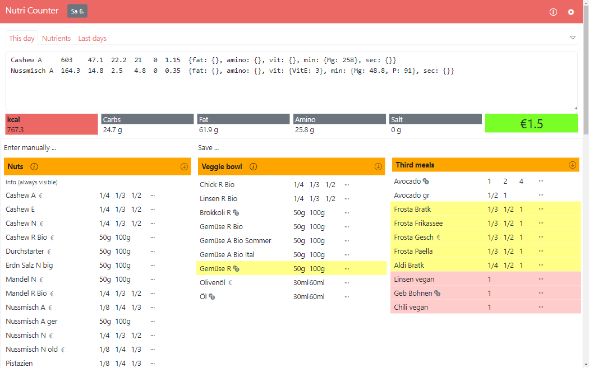
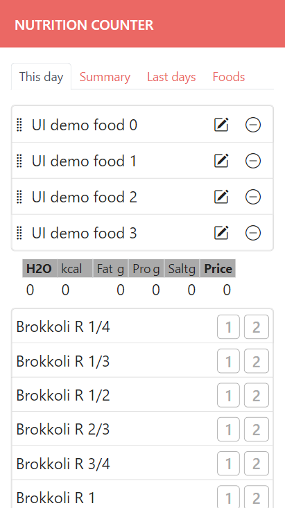
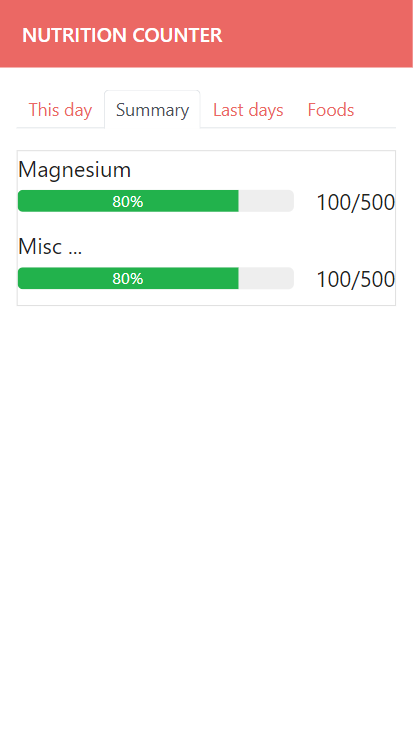

# Simple nutrition counter

(in development)

Counts nutrients as simple as possible (one tab per ingredient). Helps improving your daily nutrient intake to improve general health and brain function. It also calculates partially used ingredients.

- [Mission](#mission)
- [Usage](misc/usage.md)
- [Possible future extensions](#possible-future-extensions)
- [Developer information](misc/dev_info.md)
  - [Model](misc/dev_info.md#model)
- [License](#license)

**Disclaimer:** Use the app and recommendations included in it at your own risk. This app is in developemt, the recommended amounts might be wrong.

<table>
  <tr>
    <td>Current</td>
    <td>Plan (a little nicer ;)</td>
    <td>&nbsp;</td>
  </tr>
  <tr>
    <td>
      
    </td>
    <td>
      
    </td>
    <td>
      
    </td>
  </tr>
</table>

Mission
----------------------------------------------------------

Most people are deficient in one or more than one substance e.g. zinc, vitamin D, iron, ... 50% of US citizens are deficient in Magnesium, 30% are deficent in ... What if supply could be perfect? All of these substances are needed for something. Being able to track all vitamins, minerals, amino acids, faty acids seperately may make a big difference for general health and brain function. For example, Plant-based nutrition can lead to salt deficiency. Neurons need salt to function. There are may examples like this.

The problem with supplements: B12 cyanocobalamin isn't the real B12 but a cheap sythetic form, dosage while production often goes wrong and unexplored plant substances are missing. Of course it might make sense to use some supplements if you can't get enough from food. But in general food is the more natural (better) source (if free of substances like pesticides).

**Long term goal:** Handle all minimal daily logging in a single app as simple as possible (with as few clicks as possible). This isn't neccessarily nutrition only but only all that can't be handled easier (most likely nutrition and daily expenses = actual consumption).

This kind of project might be AI proof because AI solution would be: it watches you while cooking and counts the calories. Do you want that?

Possible future extensions
----------------------------------------------------------

(duplicate)

- [ ] **(started)** track more substances like magnesium
- [ ] **(started)** input dialog for rarely used ingredients
- [x] also track cost of used ingredients
- [ ] **(started)** track all daily data in a single app: daily cost, add special buyings ...
- [ ] **(started)** improve js code

and maybe (advanced)

- add buttons with amounts in the food list if helpful (less entries)
- multi user (new folder data/NAME manually)
- use some nutrient database with quality data (if available) ins of manually entering the value
  - maybe use barcode scanner (fill foods.yml)

LICENSE
----------------------------------------------------------

Copyright (C) Walter A. Jablonowski 2024, free for non-commercial users currenlty under AGPLv3 [License](https://choosealicense.com/licenses/agpl-3.0), \
commercial licensees must support the development

This app is build upon PHP and free software (see [credits](credits.md)).

[Privacy](https://walter-a-jablonowski.github.io/privacy.html) | [Legal](https://walter-a-jablonowski.github.io/imprint.html)
