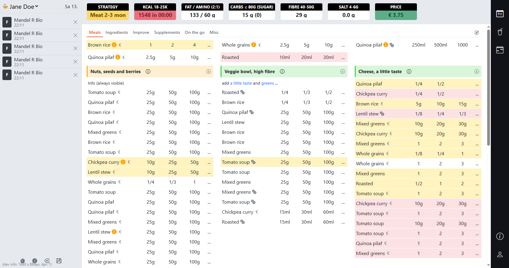

# Simple nutrition counter

Improves general health, brain function and life quality by improving daily nutrients
as simple as possible, see [mission](#mission).

- [Project state](#project-state)
- [Mission](#mission)
  - [Long term goal](#long-term-goal)
- [LICENSE](#license)


Project state
----------------------------------------------------------

I use it on a daily basis since months, but it is in development...

Usable for single user, but still in development, see [project state](#project-state)

Currently I am saving time for different projects by skipping features that I don't necessarily need.




Mission
----------------------------------------------------------

Always improve your primary tool first, which is the brain, then improve your projects.
This requires a constant time invest on a daily basis, but it will have a positive effect
on all following activities (multiplier).

There are at least ~43 vitamins, minerals, fatty acids, amino acids... It is likely that one
is deficient in more than one substance. If foods change from time to time, deficiencies
might change. Well known samples of deficiencies: Vitamin D, Omega 3, Zinc...

All nutrients are needed for something, e.g. the activity of neurons. Improving the supply may
make a big difference for general health and brain function.

```
                                                Special supplements  Powerful methods, AI, tools
                                                   |                   |
                                                   v                   v
Improve [x] Nutrients  --> Improves general --> Improves brain --> Multiples productivity
        [-] Water          health               function
        [x] Sports            |                       |
        [ ] Sleep             |                        ----------> Improves life quality,
        [ ] No stress         |                                    perception, feel better
            ... *             |
        [x] Supplements        ----------------------------------> Longevity & healthspan

        [x] we also count finance in a single app

x = can be counted with this app (manually impossible)
* = also consider: air quality, amount of sunlight, ... and so on
```

**The problem with supplements:** B12 cyanocobalamin isn't the real B12 but a cheap synthetic form,
dosage while production often goes wrong and unexplored substances from food are missing. Of course
it might make sense to use some supplements if you can't get enough from food. But in general food
is the more natural (better) source, as long as it is free from substances like pesticides.

### Long term goal

Handle all minimal daily logging in a single app as simple as possible (with as few clicks
as possible). Primarily nutrients, but all that can't be handled easier.

This kind of project might be AI proof because AI solution would be: it watches you
while cooking and counts the nutrients. Do you want that?


Misc
----------------------------------------------------------

Full UI design see [UI design](dev_info/UI_Design.md)


LICENSE
----------------------------------------------------------

Copyright (C) Walter A. Jablonowski 2024-2026, free for **personal use only** under the [license](LICENSE) \
please contact me if you want to use it commercially (you need to support the development)

This app is build upon PHP and free software (see [credits](credits.md)).

[Privacy](https://walter-a-jablonowski.github.io/privacy.html) | [Legal](https://walter-a-jablonowski.github.io/imprint.html)
