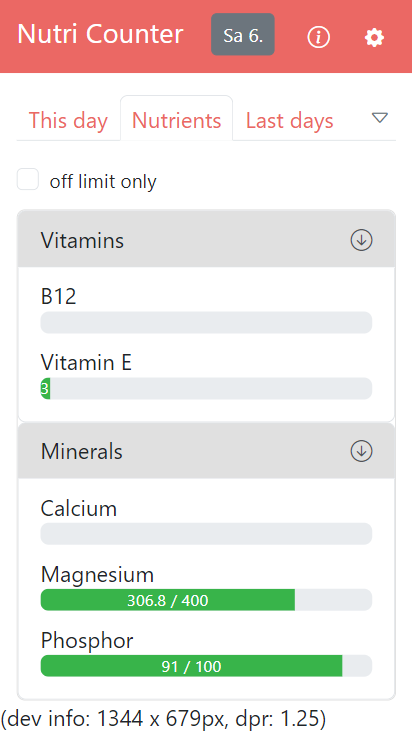

# Simple nutrition counter

Improves general health, brain function and life quality by improving daily nutrients as simple as possible, see [mission](#mission).

**State:** Usable for single user, but still in development, see [project state](#project-state)

- [Mission](#mission)
- [Project state](#project-state)
- [Usage](misc/usage.md)
- [Developer information](misc/dev_info.md)
  - [Model](misc/dev_info.md#model)
- [License](#license)


Mission
----------------------------------------------------------

```
                                                Special supplements  Powerful methods, AI, tools
                                                   |                   |
                                                   v                   v
Improve [x] Nutrients  --> Improves general --> Improves brain --> Multiples productivity
        [x] Sports *       health               function           (all your projects)
        [ ] Sleep             |                       |
        [ ] No stress *       |                        ----------> Improves life quality,
            ... *             |                                    perception, feel better
                              |
        [x] Supplements        ----------------------------------> Longevity & healthspan

        [x] we also count finance and all minimal needed in one app

* = humans were designed for movement and short term stress only (minutes)
    also consider: air quality, amount of sunlight, ... and so on
x = can be counted with this app (nutrients manually impossible, far too many)
```

There are many vitamins, minerals, fatty acids, amino acids... It is likely that one is deficient in more than one substance, just because there are so many. Well known samples of deficiencies: Magnesium, zinc, vitamin D, omega 3, but the list is much longer ...

All of these substances are needed for something. Being able to have perfect supply on a daily basis may make a big difference for general health and brain function.

Even if you eat healthy, having a perfect supply is nearly impossible. For example, plant-based nutrition can lead to salt deficiency. Neurons need salt to function.

Movement sample: activates sectors in the brain that are switched off while sitting. This is because we are designed to be active only while moving. Physical movement activates the brain makes us intelligent.

**The problem with supplements**

B12 cyanocobalamin isn't the real B12 but a cheap synthetic form, dosage while production often goes wrong and unexplored plant substances are missing. Of course it might make sense to use some supplements if you can't get enough from food. But in general food is the more natural (better) source, as long as it is free of substances like pesticides.

**Long term goal**

Handle all minimal daily logging in a single app as simple as possible (with as few clicks as possible). Primarily nutrients, but this isn't necessarily nutrition only but only all that can't be handled easier.

( This kind of project might be AI proof because AI solution would be: it watches you while cooking and counts the calories. Do you want that? )


Project state
----------------------------------------------------------

In use on a daily basis as a single user app since months, but it is still in development...

**Upcoming features**

- [ ] Improve food list **(started)**
- [ ] Finish nutrients tab **(started)**
- [ ] Code extensions like types per day entry
- [ ] Improve UI and make nicer **(started)**
- [ ] Code improvements
- When this is done food and nutrients data will be entered, and a few useful minor features may be added
- [ ] Maybe: The simple textarea might be replaced with a sortable html list (that already exists)
- [ ] Maybe: Basic error handling

**Limitations**

Currently I am saving time for different projects by skipping features that I don't necessarily need as a single user.

- All multi user function like login, session, settings ...
- Forms for editing all the data (can be done im yml)
- Advanced features like importing food data via smartphone cam and AI (most likely this would cost fees)

**Simplifications (the best is no)**

- No complex frameworks
- No db will be used

<table>
  <tr>
    <td>Older</td>
    <td>Plan (will be nicer ;)</td>
    <td>&nbsp;</td>
  </tr>
  <tr>
    <td>
      
    </td>
    <td>
      
    </td>
    <td>
      
    </td>
  </tr>
</table>


LICENSE
----------------------------------------------------------

Copyright (C) Walter A. Jablonowski 2024, free for non-commercial users currently under AGPLv3 [License](https://choosealicense.com/licenses/agpl-3.0), \
commercial licensees must support the development

This app is build upon PHP and free software (see [credits](credits.md)).

[Privacy](https://walter-a-jablonowski.github.io/privacy.html) | [Legal](https://walter-a-jablonowski.github.io/imprint.html)
