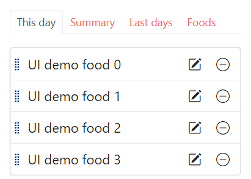

# Simple nutrition counter

Improves general health, brain function and life quality by improving daily nutrients
as simple as possible, see [mission](#mission).

**State:** Usable for single user, but still in development, see [project state](#project-state)

- [Mission](#mission)
- [Project state](#project-state)
- [Upcoming features](#upcoming-features)
- [Usage](misc/usage.md)
- [Developer information](misc/dev_info.md)
  - [Model](misc/dev_info.md#model)
- [License](#license)


Mission
----------------------------------------------------------

There are at least ~43 vitamins, minerals, fatty acids, amino acids... Most people eat
similar food every day. It is likely that one is deficient in more than one substance,
just because there are so many. Well known samples of deficiencies: Vitamin D, Omega 3,
Zinc...

All nutrients are needed for something. Being able to have perfect supply on a daily
basis may make a big difference for general health and brain function.

```
                                                Special supplements  Powerful methods, AI, tools
                                                   |                   |
                                                   v                   v
Improve [x] Nutrients  --> Improves general --> Improves brain --> Multiples productivity
        [-] Water          health               function           
        [x] Sports            |                       |
        [ ] Sleep             |                        ----------> Improves life quality,
        [ ] No stress         |                                    perception, feel better
            ... *             |
        [x] Supplements        ----------------------------------> Longevity & healthspan

        [x] we also count finance in a single app

x = can be counted with this app (manually impossible)
* = also consider: air quality, amount of sunlight, ... and so on
```

**The problem with supplements:** B12 cyanocobalamin isn't the real B12 but a cheap synthetic form,
dosage while production often goes wrong and unexplored substances from food are missing. Of course
it might make sense to use some supplements if you can't get enough from food. But in general food
is the more natural (better) source (as long as it is free from substances like pesticides).

### Long term goal

Handle all minimal daily logging in a single app as simple as possible (with as few clicks
as possible). Primarily nutrients, but all that can't be handled easier.

( This kind of project might be AI proof because AI solution would be: it watches you
while cooking and counts the nutrients. Do you want that? )


Project state
----------------------------------------------------------

I use it on a daily basis since months, but it is still in development...

**Limitations**

Currently I am saving time for different projects by skipping features that I don't
necessarily need.

- All multi user function like login, session, settings ...
  - a simplified version is in development where you add a new user just by adding a file sys folder
- Forms for editing all the data (can be done im yml)
- Advanced features like importing food data via smartphone cam and AI (most likely
  this would cost fees)

**Simplifications (the best is no)**

- No complex frameworks
- No db will be used

<table>
  <tr>
    <td>Currently</td>
    <td>Nutrients</td>
  </tr>
  <tr>
    <td>
      
    </td>
    <td>
      
    </td>
  </tr>
</table>


Upcoming features
----------------------------------------------------------

High priority first

- [ ] food concept **(started)**
- [ ] track all nutrients **(started)**
- usability
  - [ ] readability on mobile
- clean up: extend app structure, write classes, ...
  - [ ] Code extensions like types per day entry
  - [ ] Maybe: Basic error handling

Beside that things like app layout or multi user functions might be done occasionally (less important).

Advanced: extend features (finance and similar see Mission)

Full UI design see [UI design](misc/UI_Design.md)

<table>
  <tr>
    <td>New app layout</td>
    <td>Improved list design</td>
  </tr>
  <tr>
    <td>
      
    </td>
    <td>
      
    </td>
  </tr>
</table>


LICENSE
----------------------------------------------------------

Copyright (C) Walter A. Jablonowski 2024, free for non-commercial users currently under AGPLv3 [License](https://choosealicense.com/licenses/agpl-3.0). \
In the unlikely event that a company can find my project: Contact me for a license.

This app is build upon PHP and free software (see [credits](credits.md)).

[Privacy](https://walter-a-jablonowski.github.io/privacy.html) | [Legal](https://walter-a-jablonowski.github.io/imprint.html)
